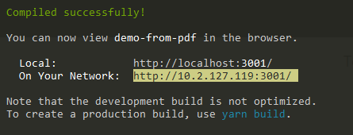

React-And-Redux文中目录结构：
+ My-app
	+ config
	+ public
	+ scripts
	+ src
	  .gitigonre
	  package.json
	  readme.md


自己用create-react-app生成项目目录：
+ My-app
	+ public
	+ src
	  .gitignore
	  package.json
	  readme.md
	  yarn.lock


create-react-app只依赖三个包：
1. react
2. react-dom
3. react-scripts

那么配置webpack应该去react-scripts里去查找
如果和其他demo有端口冲突，那么好奇心驱使，找了找设置port的文件，在`node_modules/react-scripts/scripts/start.js`中const变量DEFAULT_PORT

在执行完`yarn-start`启动app后，cmd打印了两行提示
  
那么如果移动设备与开发机器处于同一局域网中，可以通过network进行移动端调试，可能需要关闭电脑的防火墙来通过对文件的访问(?)。


处于生命周期中的
1. getDefaultProps() 报错`Warning: getDefaultProps was defined on Counter, a plain JavaScript class. This is only supported for classes created using React.createClass. Use a static property to define defaultProps instead.` 使用 ES6 语法，可以直接定义 defaultProps 这个类属性来替代，这样能更直观的知道 default props 是预先定义好的对象值。
```
Counter.defaultProps = { count: 0 }
```
2. getInitialState() 在使用es6的class语法时是没有这个钩子函数的，可以直接在constructor中定义this.state。此时可以访问this.props

实际上getInitialState和getDefaultProps两个方法在ES6的方法定义的React组件中根本不会用到，在ES6中通过给this.state赋值完成状态的初始化，通过给类属性defaultProps赋值指定props初始值


生命周期打印结果：
CounterParent render   --CounterParent.js

constructor: First
componentWillMount
render First

constructor: Second
componentWillMount
render Second

constructor: Third
componentWillMount
render Third

componentDidMount First
componentDidMount Second
componentDidMount Third
render函数只是返回一个JSX表示的对象，然后由React库来根据返回对象决定如何渲染

componentWillMount既可以在服务端被调用，也可以在浏览器端被调用。
componentDidMount只能在浏览器端被调用。

componentWillUpdate和componentDidUpdate  在服务端使用React渲染时，无论更新发生在服务器端还是浏览器，该函数都会被调用(componentDidUpdate!!)，正常情况下服务器端不会调用componentDidUpdate函数。

[装载时]React是用来取代jQuery的，如果配合使用，那么就需要利用componentDidMount被执行时，DOM已经存在，事件处理函数也已经设置好，这个时候就可以调用jQuery了，在已经绘制的DOM基础上增强新的功能
[更新时]当组件被更新时，原有的内容被重新绘制，需要在componentDidUpdate函数再次调用jQuery代码


执行this.forceUpdate()会重新渲染父组件
```
console.log('enter ControlPanel render');
    return (
      <div style={style}>
        <Counter caption="First"/>
        <Counter caption="Second" initValue={10} />
        <Counter caption="Third" initValue={20} />
        <button onClick={ () => this.forceUpdate() }>
          Click me to re-render!
        </button>
      </div>
    );

enter ControlPanel render
```

style={{color: 'red'}}外层花括号代表的是JSX语法，内层花括号表示这是一个对象


解构赋值：
`const {caption} = this.props;`  ===  `var caption = this.props.caption;`


### propTypes检查
props是组件的对外接口，如何规范：
1. 这个组件支持哪些props
2. 每个props应该是什么样的格式(类型)

> React.PropTypes 自 React v15.5 起已弃用。请使用 prop-types 库代替。

prop-types只是辅助开发，并不会改变组件的行为。


state必须是一个对象


this.setState  首先改变this.state的值，然后驱动组件经历更新过程，使得this.state的新值出现在界面上。


### props和state的对比
1. props用于定义外部接口，state用于记录内部状态
2. props的赋值在外部世界使用组件时，state的赋值在组件内部
3. 组件不应该改变props的值，state存在的目的就是让组件来改变的

React并没有办法阻止你去修改传入的props对象，约定不去修改，不然最后可能遇到不可预料的bug。


组件：
1. React.createClass
2. class
3. stateless functional component 无状态组件

constructor是ES6中类class的构造函数，并不是每个组件都需要定义构造函数。

需要构造函数的情况：
1. 初始化state，供组件生命周期中任何函数访问
2. 绑定成员函数的this环境


componentWillReceiveProps(nextProps) 不管父组件传给子组件的props有没有改变，都会触发子组件的componentWillReceiveProps函数


`<button onClick={ () => this.forceUpdate() }>`看起来简洁。其实不提倡。因为每次渲染都会创造一个新的匿名方法对象，而且有可能引发子组件不必要的重新渲染。


文中说调用forceUpdate后，每个组件的render都被调用，优化办法就是加入shouldComponentUpdate()控制谁需要被render

shouldComponentUpdate(nextProps,nextState)返回一个布尔值，
1. true  继续更新
2. false  立即停止更新，不引发后续的渲染


componentWillUnmount   如果在componentDidMount中用非React的方法创造了一些DOM元素，如果不清理会造成内存泄漏，需要在componentWillUnmount中把这些创造的DOM元素清理掉。


EventEmitter实例对象支持下列相关函数：
1. emit函数  广播一个特定事件，(第一个)参数是字符串类型的事件名称
2. on函数  增加一个挂在EventEmitter对象特定事件上的处理函数  第一个参数是字符串类型的事件名称，第二个参数是处理函数
3. removeListener函数  删除挂在这个EventEmitter对象特定事件上的处理函数，如果要调用removeListener函数，就一定要保留对处理函数的引用。